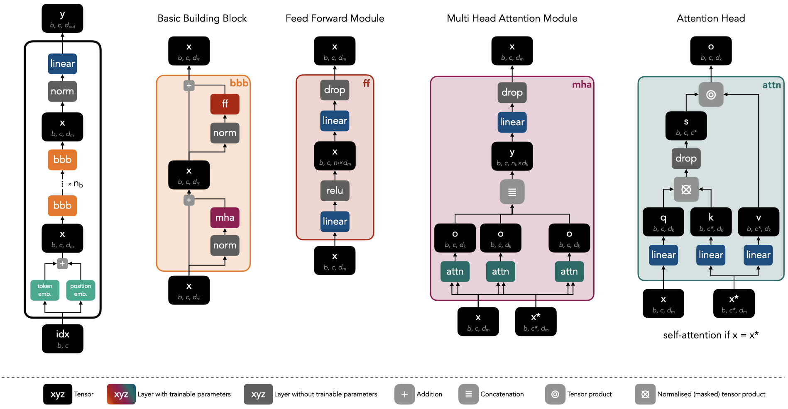

# 📚 nanoGPT 📚

Implementation of the [nanoGPT tutorial](https://www.youtube.com/watch?v=kCc8FmEb1nY) from Andrej Karpathy.


## 🏗️ Transformer Decoder Architecture

The following figure shows the transformer decoder architecture used in this project. It provides a clear overview of the individual building blocks, as well as the tensors and their dimensions, as they pass through the network.

For more information on the dimensions of input and output tensors, please refer to the `dimensions.ipynb` notebook. This resource will offer a deeper understanding of the architecture's tensor dimensions.




## 🧪 Experiments

I ran two experiments that can be found in the `training.ipynb` notebook. The first one used a smaller model, and the second one involved a larger model, just for comparison. You can see the results of these experiments below.

### 🐜 Smaller model

The smaller model contained 54,977 parameters and finished training after 3.64 minutes. Here is the training and validation loss over time:


Below is an example of some text generated by the trained neural network.

```
MAREETINGB:
Uan.

LAM:
Burcorin me will hat?

Misen:
So do to of Greghd Leardtay, thou not tilenge, and fack!
Your Sut'surcorbaces, and nar. YORD VINCEE VIZLONKING You, thear grat, shend a to mee Bum gove eich.


ILARDY.
YO:

Pentled sird groving not this
I by behherrath dume.
Gaje iffe hin thoughbs. MAre!

LABEF SILE:
ICIE in I'dent, thou she goves, voing:
Dregelaur, as you for deote'

CamJy maune.

My so, So hothome that to thiHles
Penthere mow besobld.


GBESUSenmourstlit becouster us the sin
```

### 🦣 Larger model

The smaller model contained 10,788,929 parameters and finished training after 49.14 minutes. Here is the training and validation loss over time. We can see that the network already started overfitting after about 2000 training steps.


Below is an example of some text generated by the trained neural network.

```
With her what sighing and fame
As lives received with thee. You are done!

AUTOLYCUS:
No, sir; and fill my knavers.
Hath not you power for such beauty
To make her hands: what a feast the niece,
Having power your state in my soul
'O, proud much beloved, and leave it so subject!'
With we straight gs, I did but joy hence,
I dark she henceforce to spend at:
But when 'shreeticles shall proclaim yet?
Either vow, so much we both reversion them.

ESCALUS:
If I do seek a sob and flatter
Lawly pillance, w
```

### 😵‍💫 Untrained larger model

For comparison here is an example text the is produced by an untrained transformer, the larger model in this case:
 
```
hn;.h;'IyiwHhuRDilRrYfAVeqhbo'kKxoLZbKH?$;KZe3qCxA:upQHLg$doVdAaieqsfpK
ANCq HNxOOakChOuGRHPDmh,rP.dGXUoBkeTIzRmQaNVgMQSYj&VqFTjyjMFvbiKAiOAN;GqFBqgeMZjPVc?- Vyr-rKM.vznrrDrQMNCiN.qMZ'AVC.C&Z-3aIIBgrhRn?rZwC.bnaeLCUkU?rIZscqQBYlvbbl;pJGjUH?BYIwGLIBwZ.F?-VSCSAWlSZYcmKJ3sX,QgweJDziHs?zKNG
i!KW?GrVitYAxilBlBnDLIKzEm$vyZSspYFsDTWwRpRRjpJSMwn-pwhzpeaZmKNSKlXnPHsHGoQTOfsRakBPzOZO3iRqF?wZsRF$ZGPrmXYYX&fTOQQrb?sibji,;EDvi;LpFmLZRG$GwtXfnMD-aHsjQiVGhhUre:z-NQa sGd?VPMYL.gkT;PQRDH xHO&3OsaOjvbu?,GpOMosd-Q
```
